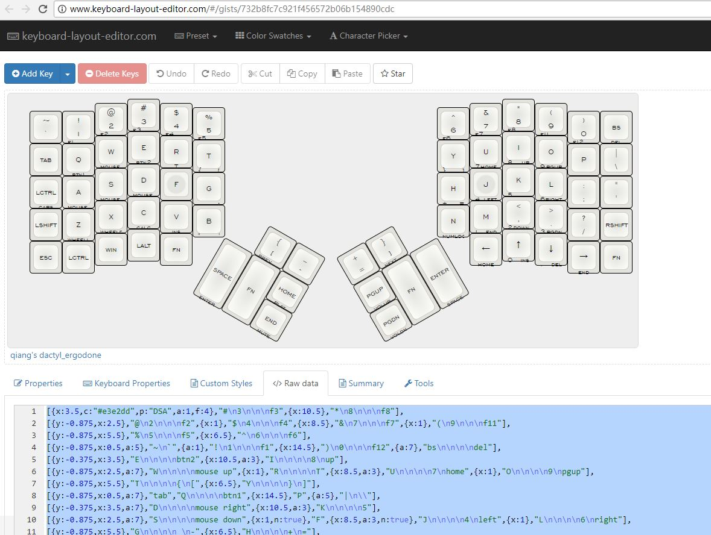

### Step 1. 在KLE上修改配列
建议直接在我的配列基础上进行修改：
> [qiang's dactyl layout][1]
[1]:
http://www.keyboard-layout-editor.com/##@_name=qiang's%20dactyl%2F_ergodone%3B&@_x:3.5&c=%23e3e2dd&p=DSA&a:1&f:4%3B&=%23%0A3%0A%0A%0Af3&_x:10.5%3B&=*%0A8%0A%0A%0Af8%3B&@_y:-0.875&x:2.5%3B&=%2F@%0A2%0A%0A%0Af2&_x:1%3B&=$%0A4%0A%0A%0Af4&_x:8.5%3B&=%2F&%0A7%0A%0A%0Af7&_x:1%3B&=(%0A9%0A%0A%0Af11%3B&@_y:-0.875&x:5.5%3B&=%25%0A5%0A%0A%0Af5&_x:6.5%3B&=%5E%0A6%0A%0A%0Af6%3B&@_y:-0.875&x:0.5&a:5%3B&=~%0A%60&_a:1%3B&=!%0A1%0A%0A%0Af1&_x:14.5%3B&=)%0A0%0A%0A%0Af12&_a:7%3B&=bs%0A%0A%0A%0Adel%3B&@_y:-0.375&x:3.5%3B&=E%0A%0A%0A%0Abtn2&_x:10.5&a:3%3B&=I%0A%0A%0A%0A8%0Aup%3B&@_y:-0.875&x:2.5&a:7%3B&=W%0A%0A%0A%0Amouse%20up&_x:1%3B&=R%0A%0A%0A%0AT&_x:8.5&a:3%3B&=U%0A%0A%0A%0A7%0Ahome&_x:1%3B&=O%0A%0A%0A%0A9%0Apgup%3B&@_y:-0.875&x:5.5%3B&=T%0A%0A%0A%0A%7B%0A%5B&_x:6.5%3B&=Y%0A%0A%0A%0A%7D%0A%5D%3B&@_y:-0.875&x:0.5&a:7%3B&=tab&=Q%0A%0A%0A%0Abtn1&_x:14.5%3B&=P&_a:5%3B&=%7C%0A%5C%3B&@_y:-0.375&x:3.5&a:7%3B&=D%0A%0A%0A%0Amouse%20right&_x:10.5&a:3%3B&=K%0A%0A%0A%0A5%3B&@_y:-0.875&x:2.5&a:7%3B&=S%0A%0A%0A%0Amouse%20down&_x:1&n:true%3B&=F&_x:8.5&a:3&n:true%3B&=J%0A%0A%0A%0A4%0Aleft&_x:1%3B&=L%0A%0A%0A%0A6%0Aright%3B&@_y:-0.875&x:5.5%3B&=G%0A%0A%0A%0A%2F_%0A-&_x:6.5%3B&=H%0A%0A%0A%0A+%0A%2F=%3B&@_y:-0.875&x:0.5&a:7%3B&=lctrl%0A%0A%0A%0Acaps&=A%0A%0A%0A%0Amouse%20left&_x:14.5&a:5%3B&=%2F:%0A%2F%3B&=%22%0A'%3B&@_y:-0.375&x:3.5&a:7%3B&=C%0A%0A%0A%0Acalc&_x:10.5&a:1%3B&=%3C%0A,%0A%0A%0A2%0Adown%3B&@_y:-0.875&x:2.5&a:7%3B&=X%0A%0A%0A%0Awheeldown&_x:1%3B&=V%0A%0A%0A%0Ains&_x:8.5&a:3%3B&=M%0A%0A%0A%0A1%0Aend&_x:1&a:1%3B&=%3E%0A.%0A%0A%0A3%0Apgdn%3B&@_y:-0.875&x:5.5&a:3%3B&=B%0A%0A%0A%0A%22%0A'&_x:6.5&a:7%3B&=N%0A%0A%0A%0Anumlock%3B&@_y:-0.875&x:0.5%3B&=lshift&=Z%0A%0A%0A%0Awheelup&_x:14.5&a:5%3B&=%3F%0A%2F%2F&_a:7%3B&=rshift%3B&@_y:-0.375&x:3.5%3B&=lalt&_x:10.5&a:3%3B&=%E2%86%91%0A%0A%0A%0A0%0Ains%3B&@_y:-0.875&x:2.5&a:7%3B&=win&_x:1%3B&=fn&_x:8.5%3B&=%E2%86%90%0A%0A%0A%0Ahome&_x:1&a:3%3B&=%E2%86%93%0A%0A%0A%0A.%0Adel%3B&@_y:-0.75&x:0.5&a:7%3B&=esc&=lctrl&_x:14.5%3B&=%E2%86%92%0A%0A%0A%0Aend&=fn%3B&@_r:30&rx:6.5&ry:4.25&y:-1&x:1&a:1%3B&=%7B%0A%5B%0A%0A%0Aprev&_a:5%3B&=%2F_%0A-%3B&@_a:7&h:2%3B&=space%0A%0A%0A%0Aenter&_h:2%3B&=fn&=home%0A%0A%0A%0Aplay%3B&@_x:2%3B&=end%0A%0A%0A%0Amute%3B&@_r:-30&rx:13&y:-1&x:-3&a:5%3B&=+%0A%2F=&_a:1%3B&=%7D%0A%5D%0A%0A%0Anext%3B&@_x:-3&a:7%3B&=pgup%0A%0A%0A%0Avolup&_h:2%3B&=fn&_h:2%3B&=enter%0A%0A%0A%0Aspace%3B&@_x:-3%3B&=pgdn%0A%0A%0A%0Avoldn

修改好后，拷贝raw里的数据:

### Step 2. 在TKG上烧配列
> 需要使用chrome浏览器，并且安装好我修改的 [TKG插件](https://github.com/hackqiang/tkg/raw/master/tkg-chrome-app.crx) 。

 - 打开支持dactyl的TKG: [http://xfactory.top/tkg/](http://xfactory.top/tkg/)
   
 - 键盘选择 `dactyl ErgoDone`
   
 - 层模式选择 `简单`
   
 - 刚刚复制的raw粘贴到 `复合层里`
   
 - 然后拔下usb线，按住键盘的 `T` 插上usb线，会发现 `烧写.eep文件按钮` 可用了，点击等待烧写结束。

配置参考下图：

#### Special thanks to：
 - Matthew Adereth：dactyl的作者，得益于他开源了设计文件(openscad)，我才能修改与打印
 - K.T.E.C：提供了平民版的ergodox -- ergodone，并开源了固件，我的dactyl就是直接用的ergodone固件 
 - lan Prest：KLE的作者 
 - kai叔：TKG的作者，实现了在线刷配列！ 
 - yang：提供了N多教程