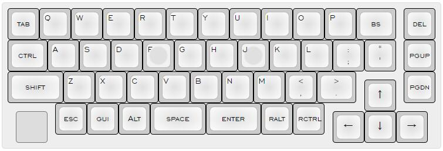
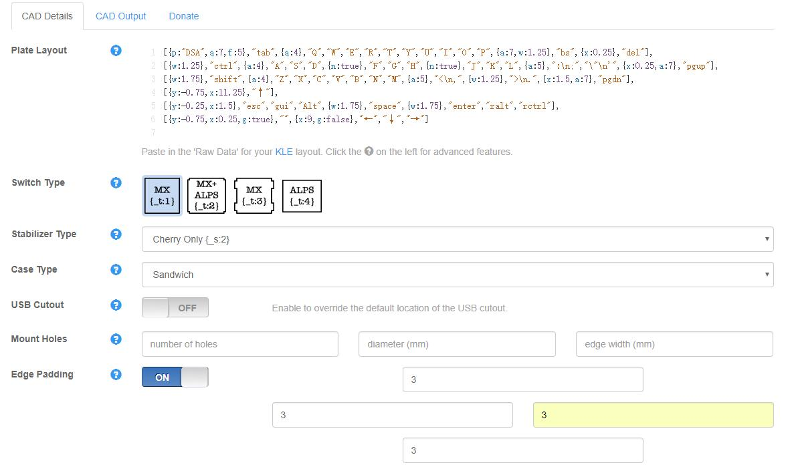
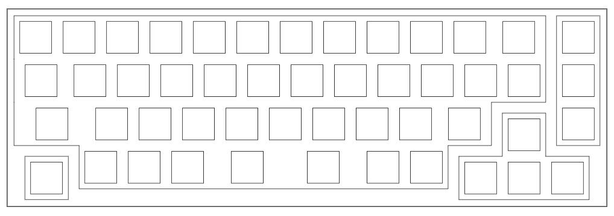
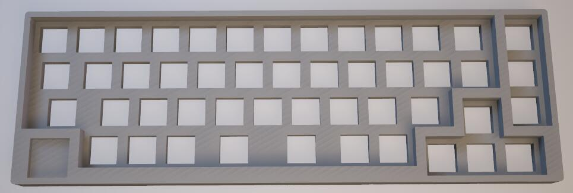

> 说是从零开始，其实那是吹牛的，毕竟没必要自己造轮子。

这篇文章主要是记录下自己做外壳的经历。

### 1. 用 [KLE](http://www.keyboard-layout-editor.com) 设计自己的配列：

### 2. 使用 [swillkb](http://builder.swillkb.com/) 来生成初步的外壳文件，在yang的建议下，这次打算尝试全高壳：

### 3. 在 `CAD Output` 中，下载 `Switch Layer` , `Top Layer` 以及 `Closed Layer` DXF文件。

### 4. top外壳设计，因为我打算把定位板和边框做在一起，所以就先合并 `Switch Layer` 和 `Top Layer`：

> 一些参数：
> 定位板厚度：4.2mm
> 外框高度：7.2mm
> 边框圆角半径：2mm

最终生成的3d图大概是这样的：

(左下角打算做个logo嵌进去）

### 5. 底部外壳设计
> 一些参数：
> 底板厚度：1mm，
> 边框厚度（含底板）：11mm，
> 铜柱外露高度10mm，
> 需要m2*14铜柱4根。

## 未完待续